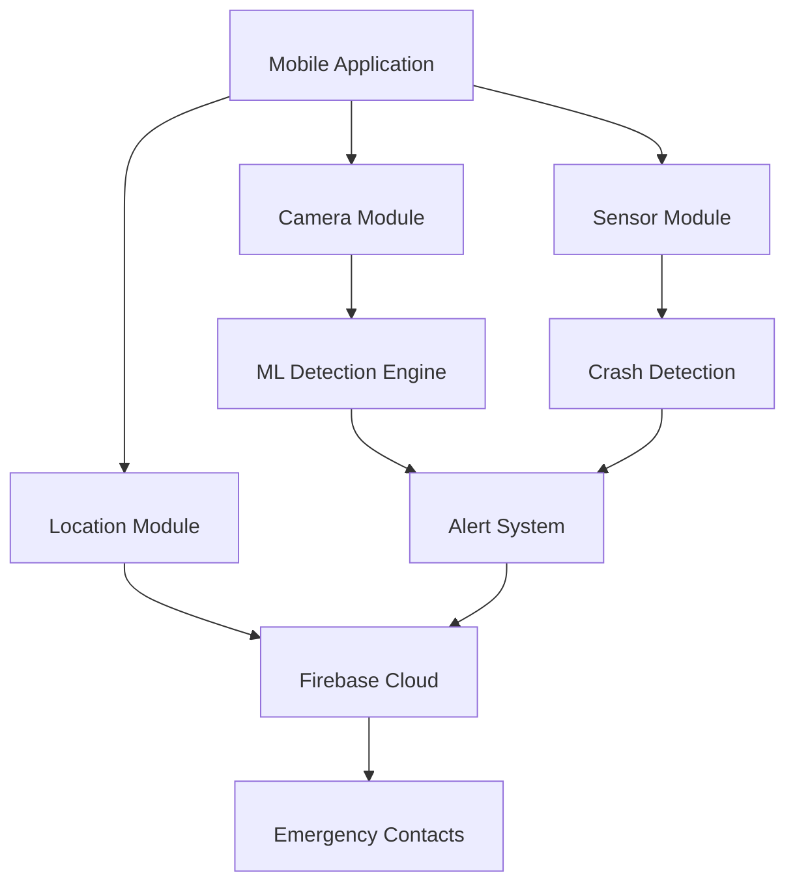

<div align="center">

# AUTONIX

### Rider Safety Assistance & Monitoring System

** Safety for all. Accessible to all. **

---


🌐  [**Visit Website**](#) | 📖 [**Documentation**](#) | 🐞 [**Report Bug**](https://github.com/yatin-anchan/Autonix/issues)

</div>

---

##  Overview

**Autonix** is an intelligent, smartphone-based **driver safety and monitoring system** engineered to reduce road accidents through real-time detection of **drowsiness, crashes, and unsafe driving patterns**.

Unlike expensive hardware-dependent systems exclusive to luxury vehicles, Autonix leverages a **smartphone's camera, GPS, and motion sensors** to democratize advanced safety technology — making roads safer, smarter, and universally accessible.

<div align="center">

### Core Mission

```
┌─────────────────────────────────────────────────────────────┐
│  DETECT → ALERT → PROTECT → RESPOND → ANALYZE → IMPROVE    │
└─────────────────────────────────────────────────────────────┘
```

</div>

---

##  Objectives

<table>
<tr>
<td width="50%">

###  Detection
- Real-time drowsiness monitoring via facial landmarks
- Eye Aspect Ratio (EAR) calculation
- Yawn and head tilt detection
- Multi-parameter fatigue analysis

</td>
<td width="50%">

###  Response
- Instant crash detection via sensor fusion
- Automated emergency contact alerts
- GPS coordinate transmission
- SOS signal broadcasting

</td>
</tr>
<tr>
<td width="50%">

###  Navigation
- Integrated trip planning system
- Turn-by-turn guidance
- Route optimization
- Real-time traffic integration

</td>
<td width="50%">

###  Analytics
- Driving behavior tracking
- Performance scoring system
- Safety trend analysis
- Fleet management dashboard

</td>
</tr>
</table>

---

##  Key Features

<div align="center">

|  Feature |  Description |  Technology |
|:---:|:---|:---|
| **Drowsiness Detection** | Multi-parameter fatigue monitoring using facial landmark analysis | MediaPipe, ML Kit, EAR Algorithm |
| **Crash Detection** | Impact detection via accelerometer & gyroscope sensor fusion | Real-time Sensor Analysis |
| **Emergency System** | Automated SOS with GPS coordinates & multi-channel alerts | Firebase Cloud Messaging |
| **Smart Navigation <br>(In Development)** | Integrated route planning with trip management | OSMdroid |
| **Fleet Management <br>(In Development)** | Multi-driver oversight with assignment & tracking | Cloud-based Dashboard |
| **Analytics Engine** | Performance metrics, safety trends & visual reports | Firebase Analytics |
| **Privacy First** | On-device detection with encrypted cloud storage | End-to-end Encryption |

</div>

---

##  Tech Stack

<div align="center">

###  Platform & Languages


###  Backend & Services


###  Core Libraries


###  Development Tools


</div>

---

##  System Architecture

<div align="center">



</div>

###  Core Modules

<table>
<tr>
<td width="33%">

####  Entry Layer
- Splash Activity
- Welcome Activity  
- Authentication Flow

</td>
<td width="33%">

####  Safety Layer
- Drowsiness Detector
- Crash Alert Service
- Emergency Response

</td>
<td width="33%">

####  Navigation Layer
- Trip Planner
- Route Optimizer
- Map Integration

</td>
</tr>
<tr>
<td width="33%">

####  Management Layer
- Fleet Control
- Driver Assignment
- Admin Dashboard

</td>
<td width="33%">

####  Analytics Layer
- Trip History
- Performance Metrics
- Safety Reports

</td>
<td width="33%">

####  Data Layer
- Firebase Integration
- Local Storage
- Cloud Sync

</td>
</tr>
</table>

---

##  Installation

###  For End Users

<div align="center">

**[ Visit Official Website](#)** | **[ Download APK](#)**

</div>

###  For Developers

```bash
# Clone the repository
git clone https://github.com/yatin-anchan/Autonix.git

# Navigate to project directory
cd Autonix

# Open in Android Studio
# File → Open → Select Project Directory
```

####  Prerequisites

-  Android Studio Flamingo or later
-  Android device (API 29+) or emulator
-  Firebase account with project configured
-  OSMDroid (for navigation features)

####  Build & Run

1. Sync Gradle dependencies
2. Configure Firebase credentials in `google-services.json`
3. Enable required permissions (Camera, Location, SMS)
4. Build → Make Project → Run 'app'

---

##  Screenshots

<div align="center">

|  Splash |  Dashboard |  Drowsiness |  Crash |
|:---:|:---:|:---:|:---:|
|  |  |  |  |

</div>

---

##  Testing Results

<div align="center">

|  Test ID |  Test Case |  Status |  Response Time |
|:---:|:---|:---:|:---:|
| **TC01** | User Registration Flow |  Pass | <2s |
| **TC02** | Authentication System |  Pass | <1s |
| **TC05** | Drowsiness Detection Accuracy |  Pass | Real-time |
| **TC07** | Crash Detection Sensitivity |  Pass | <500ms |
| **TC09** | Emergency Alert Transmission |  Pass | <3s |

###  Performance Metrics


</div>

---

##  Future Enhancements

<table>
<tr>
<td width="50%">

###  Voice Integration
- Hands-free alert management
- Voice-activated navigation
- Natural language commands

###  Offline Capabilities
- Local alert processing
- Offline map caching
- Queue-based sync system

</td>
<td width="50%">

###  AI Enhancements
- Predictive fatigue analysis
- Behavioral pattern learning
- Risk assessment algorithms

###  Emergency Services
- Direct 911/emergency dispatch
- Hospital integration
- Real-time EMS coordination

</td>
</tr>
<tr>
<td width="50%">

###  Gamification
- Safe driving rewards
- Achievement system
- Leaderboard integration

</td>
<td width="50%">

###  Platform Expansion
- iOS application
- Web dashboard
- Smartwatch integration

</td>
</tr>
</table>

---

##  Contributors

<div align="center">

<table>
<tr>
<td align="center" width="50%">
<a href="https://github.com/maizah-shaikh">
<br />
<sub><b> Maizah Shaikh</b></sub><br/>
<sub>Developer & Researcher</sub>
</a>
    <br>
<br/>
<a href="https://github.com/maizahshaikh1004](https://github.com/maizahshaikh1004">

</a>
</td>
<td align="center" width="50%">
<a href="https://github.com/yatin-anchan">
<br />
<sub><b> Yatin Anchan</b></sub><br/>
<sub>Developer & System Architect</sub>
</a>
<br/>
    <br>
<a href="https://github.com/yatin-anchan">

</a>
</td>
</tr>
</table>

### Project Guidance

**Mr. Hasan Phudinawala**  
*Project Guide & Mentor*

**Department of Computer Science**  
Royal College of Arts, Science & Commerce  
Mira Road (E), Maharashtra, India

</div>

---

##  License

<div align="center">

This project is licensed under the **MIT License**

```
Permission is hereby granted, free of charge, to any person obtaining a copy
of this software for educational and research purposes.
```

[](LICENSE)

</div>

---

##  Support & Contact

<div align="center">

[](https://github.com/yatin-anchan/Autonix/issues)
[](https://github.com/yatin-anchan/Autonix/discussions)
[](mailto:your-email@example.com)

---

###  Show Your Support

**If this project helps improve road safety, consider giving it a star!**  
Your support drives innovation in accessible safety technology.

[](https://github.com/yatin-anchan/Autonix/stargazers)
[](https://github.com/yatin-anchan/Autonix/network)

---

** Made with dedication to road safety**

*Empowering drivers. Protecting lives. Connecting communities.*

</div>

---

<div align="center">

**© 2025 Autonix Project** | Built with ❤️ and 🍵 in India

</div>
